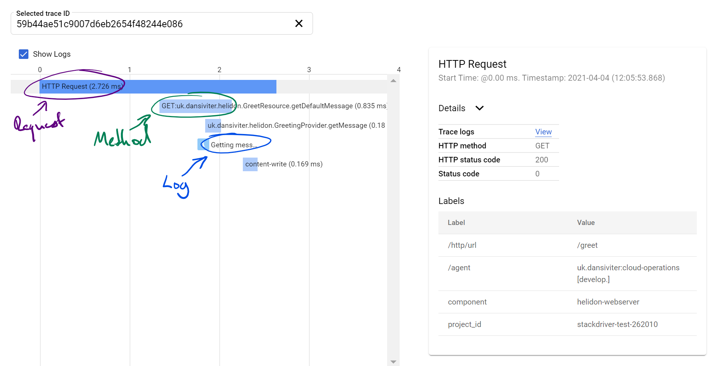

# Helidon GCP #

This is a demonstrator application using [Helidon](https://helidon.io) that hooks into Google Cloud Operations suite of Logging, Monitoring and Tracing:
* Cloud Logging: Java Util Log Handlers using asynchronous processing,
* Cloud Monitoring: Microprofile Metrics,
* Cloud Tracing: Microprofile Trace via OpenTelemetry API and log message correlation,
* Cloud Error Reporting: all `ERROR` messages flagged augmented with `serviceContext` version and name from `MANIFEST.MF`.



## Docker Images ##

This has 3 types of images:
* vanilla: OpenJDK Java 16 Alpine JRE,
* jlink: Java Platform Module System OpenJDK Java 16 Alpine,
* native: GraalVM statically linked binary off `scratch` using MUSL libc.

They all have their benefits but also pain-points.

| Image             | Size  | Start   | Stop |
|-------------------|-------|---------|------|
| `helidon:vanilla` | 202MB | 4,414ms | 62ms |
| `helidon:jlink`   | 163MB | 2,932ms | 18ms |
| `helidon:native`  | 131MB | 204ms   | 4ms  |

> :warning: Native image does have some issues around flushing final logs (see Limitations) so `STOP` is artificially fast.


## Running Locally ##

To be able to use the GCP credentials when running locally (via Docker for Desktop or similar):

```powershell
gcloud auth application-default login
docker run --rm -it `
  -p 8080:8080 `
  -e CLOUDSDK_CONFIG=/gcloud `
  -v $Env:APPDATA/gcloud/:/gcloud:ro `
  helidon:<tag>
```


## Build Graal Locally ##

```powershell
docker run -v $pwd/:/helidon:rw -v $HOME/.m2/repository/:/root/.m2/repository/:rw --entrypoint bash -it --rm helidon/jdk11-graalvm-maven:21.0.0
```


## Limitations ##

* [oracle/graal#3218](https://github.com/oracle/graal/issues/3218) `Handler#close()` not called, so tail log entries not persisted. Only Native image, but no workaround currently available.
* [oracle/helidon#2892](https://github.com/oracle/helidon/issues/2892) Unable to inject `MetricRegistry`: Workaround included in `reflect-config.json`,
* [oracle/helidon#2913](https://github.com/oracle/helidon/issues/2913) Issues using primitives in JAX-RS server and ReST Client: Workaround is don't use primitives.
* [oravle/helidon#2910](https://github.com/oracle/helidon/issues/2910) `CompletionStage` causes NPE: Workaround is don't use `CompletionStage` in JAX-RS server.
